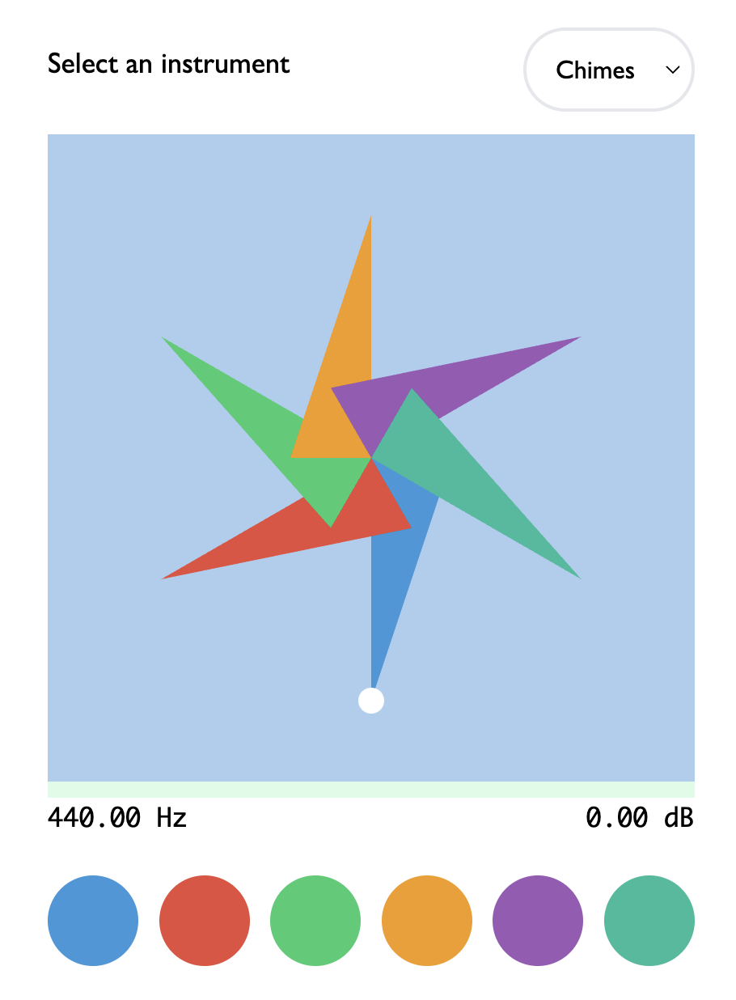

# Sonic Pinwheel

**Online:** [https://ccrma.stanford.edu/~tzfeng/pinwheel/](https://ccrma.stanford.edu/~tzfeng/pinwheel/)

Sonic Pinwheel is a web-based pinwheel instrument that runs on mobile/desktop devices. Blow the pinwheel or use ambient sounds to spin pinwheels together in melodious harmony. Create ambient music together and bathe in a sound space of sonic pinwheels, soothing winds, and sparkly chimes. A distributed, pseudo-networked, and collaborative musical experience.

