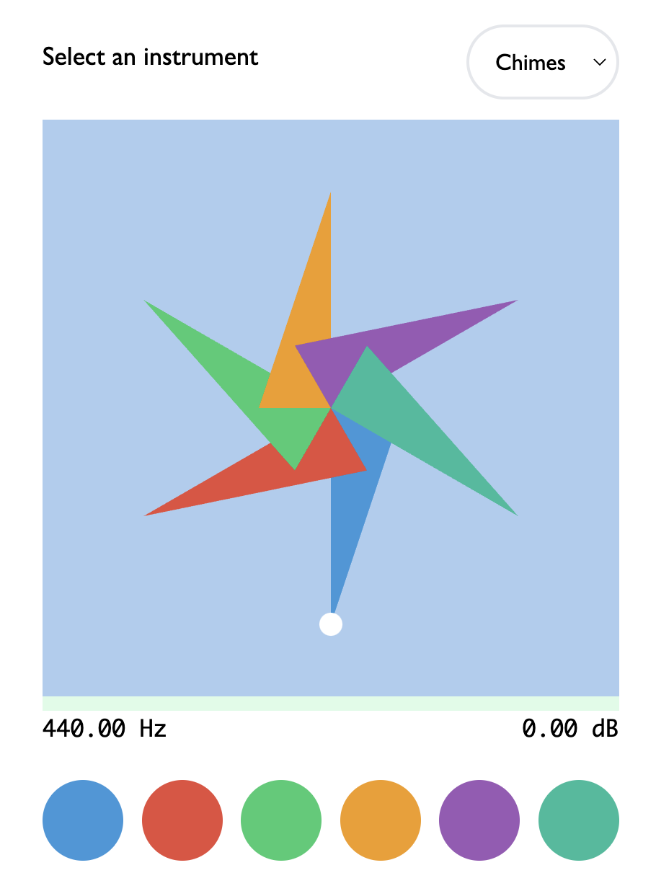

# Sonic Pinwheel

**Online:** [https://ccrma.stanford.edu/~tzfeng/pinwheel/](https://ccrma.stanford.edu/~tzfeng/pinwheel/)

Sonic Pinwheel is a web-based pinwheel instrument that runs on mobile/desktop devices. Blow the pinwheel or use ambient sounds to spin pinwheels together in melodious harmony. Create ambient music together and bathe in a sound space of sonic pinwheels, soothing winds, and sparkly chimes. A distributed, pseudo-networked, and collaborative musical experience.



## Usage

### Development

Install dependencies:
```bash
npm install
```

Start the development server:
```bash
npm run dev
```

Then open http://localhost:5173 in your browser.

### Building

Build for production:
```bash
npm run build
```

### Deployment

Deploy to CCRMA, copying `./dist/` folder.
```bash
npm run deploy
```